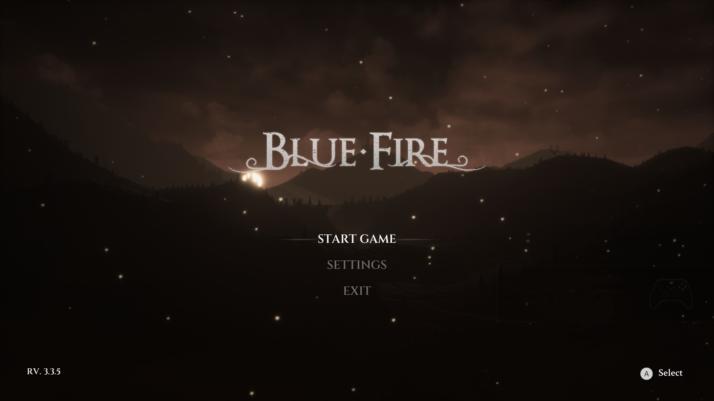

**Credits to Dmgvol**
*If file extensions aren't showing in file explorer enable them in the view settings*

# Disabling Objects

This is a useful way to disable actors in game - can be used for stuff like removing annoying enemies and effects among other things 

- Open umodel and find the content you would like to disable (In my case the main menu castle)

- Recreate the observed folder structure like you would in final paking (because we are dealing with cooked uassets)

*A useful shortcut for creating new folders is ctrl+shift+n and you can enter the name and press enter to go inside the folder*

- Create a blank text document with the same name as the uasset you want to disable and change the file extension to .uasset

- Package the folder, place in mod folder and run the game

