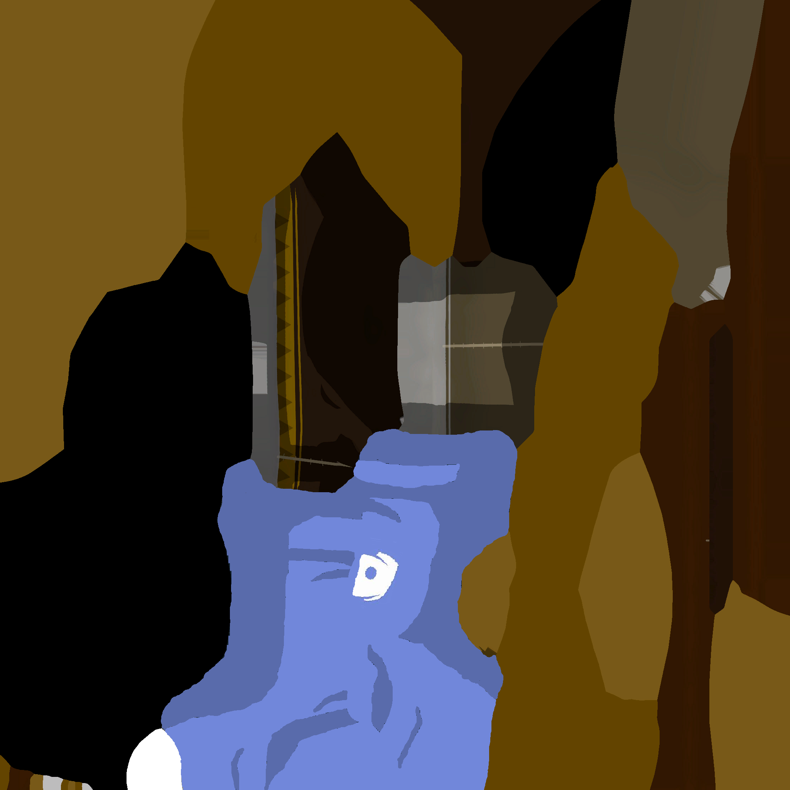
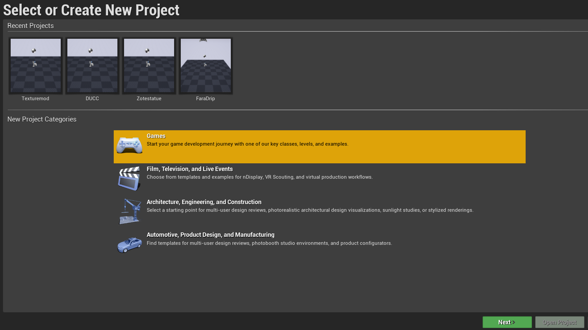
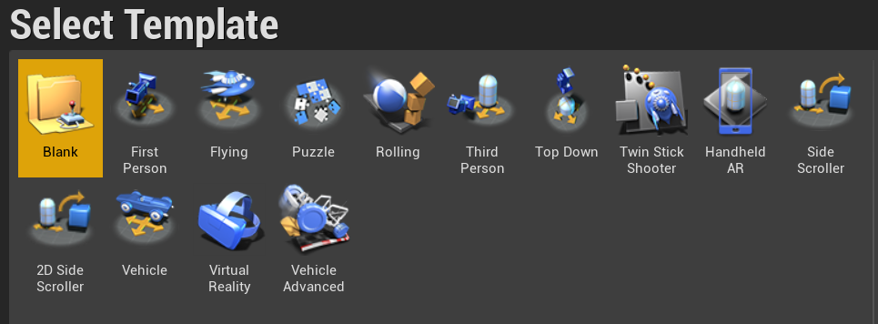
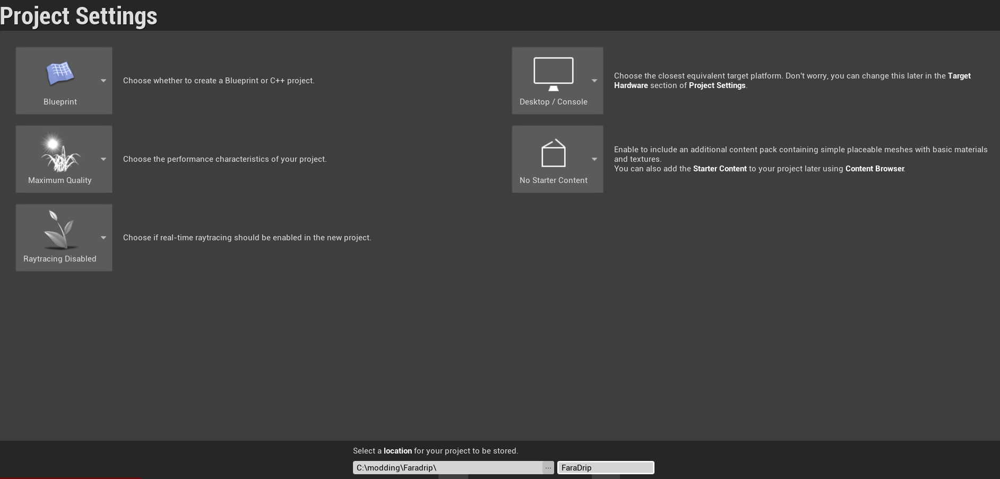
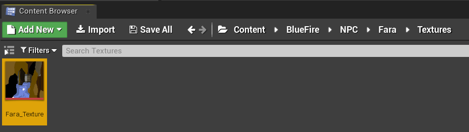

For this example I will use my Fara discord shirt as an example. Here is the original texture for Fara.

I have now changed it so that the model will have the desired change

Open Unreal Engine 4.25.4 and create a blank game project with no starter content

Go into project settings and uncheck use pak file
 

Now recreate the folder structure that was obtained from exporting from umodel in Unreal engine. In my case the folders went UmodelExport\BlueFire\NPC\Fara\Textures so I must create the folders like this:

