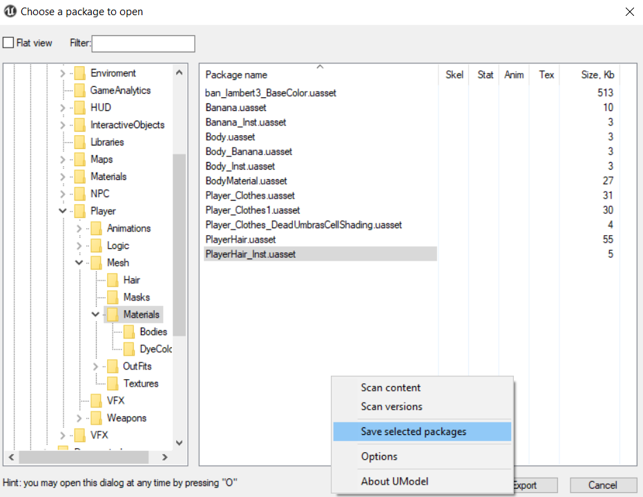
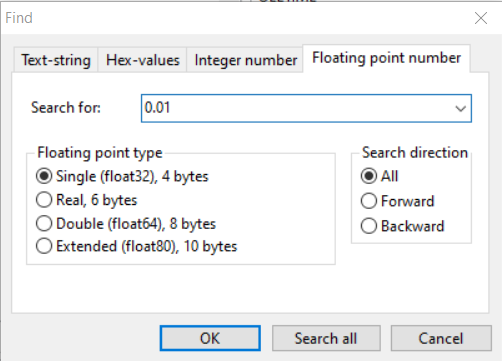
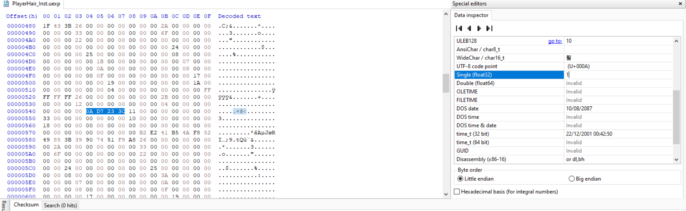

**Credits to FatihG_ for the second method and Dmgvol for the [GRcolorswapper tool](https://github.com/Dmgvol/GR_Guides/blob/main/Tools/GRColorSwapper.zip)**

- For colour editing, you can hex edit a material
- For this, export your material from Umodel in both ways so that you have the uasset and the props.txt

- Open the props.txt and find the values you would want to change

- Open the .uexp file for the material in a hex editor
- ctrl+F and search for the value with these settings if in HxD

- If it's a common number like one, unfortunately you'll have to use trial and error for parameters other than vector (for vector GRcolorswapper can be used)
- Make your edit in the data inspector and save

- Pack as normal

For automating replacing colours, use Dmgvol's [GRcolorswapper](https://github.com/Dmgvol/GR_Guides/blob/main/Tools/GRColorSwapper.zip) and follow this guide [here](https://github.com/Dmgvol/GR_Guides/blob/main/ColorSwap.md)

- There is also an alternate (pretty much obsolete) method for editing material instances in engine that I will put here for the sake of documentation

*the only reason I would use this is if I wanted everything in one project but then again just put the uexp in the final paking folders*

