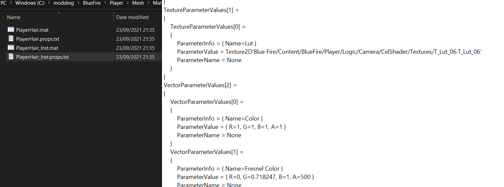
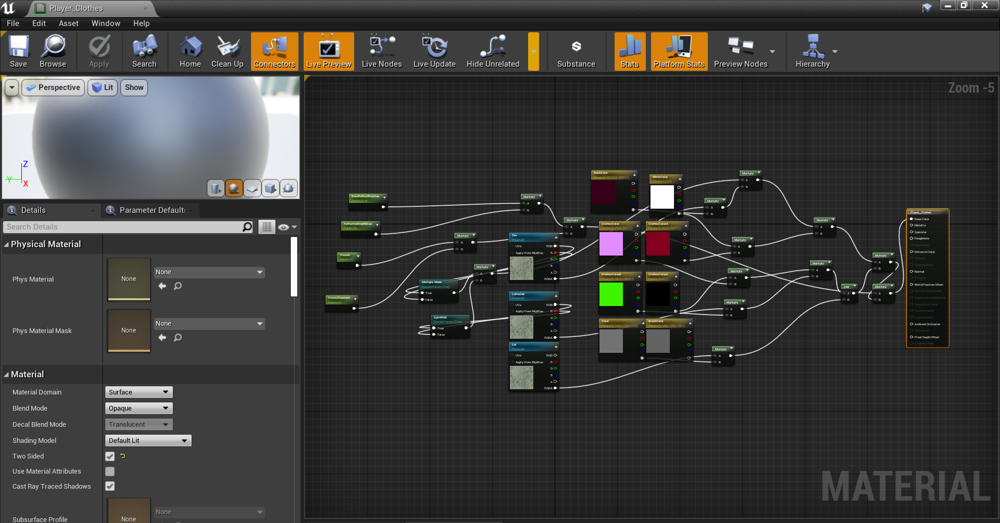

# Materials

**Credits to atenfyr for [UassetGUI](https://github.com/atenfyr/UAssetGUI/releases) FatihG_ for the last method and Dmgvol for the [GRcolorswapper tool](https://github.com/Dmgvol/GR_Guides/blob/main/Tools/GRColorSwapper.zip)**

For pretty much everything, you can hex edit a material

### Convenient Method
This has no downsides to the other methods. The other methods are here if others wish to know them.
- Download [UassetGUI](https://github.com/atenfyr/UAssetGUI/releases) by atenfyr
- Set the version to whatever version of UE your game uses(For Blue Fire it's 4.25)
- Open the target material and search the exports for parameter values
- These can be changed in any way you wish
- If opened from the export folder, 

### Manual method
- For this, export your material from Umodel in both ways so that you have the uasset and the props.txt

- Open the props.txt and find the values you would want to change

- Open the .uexp file for the material in a hex editor
- ctrl+F and search for the value with these settings if in HxD

- If it's a common number like one, unfortunately you'll have to use trial and error for parameters other than vector (for vector GRcolorswapper can be used)
- Make your edit in the data inspector and save

- Pack as normal

For automating replacing colours, use Dmgvol's [GRcolorswapper](https://github.com/Dmgvol/GR_Guides/blob/main/Tools/GRColorSwapper.zip) and follow this guide [here](https://github.com/Dmgvol/GR_Guides/blob/main/ColorSwap.md)

### In engine method
- There is also an alternate (pretty much obsolete) method for editing material instances in engine that I will put here for the sake of documentation

*the only reason I would use this is if I wanted everything in one project but then again just put the uexp in the final paking folders*

- First export the material instance you wish to modify normally using umodel
- Create a blank UE4 project (remember to untick use pak file) and create the appropriate folders for the material
- Create a new material and create parameters inside the material for each of the parameters in the props.txt
- Set them with their default values and names
- Connect all the parameters to the main node using math nodes (how you do it is not important)

- Once that is done, save the material and create a material instance of it with the same name as in the game files
- You can now edit the parameters as you please
- Once you are happy with the changes, save and package the project
- Package as normal except remove the parent material assets so that the parent material does not overwrite the actual parent material

