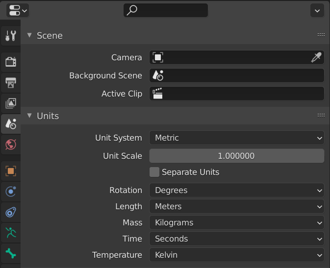
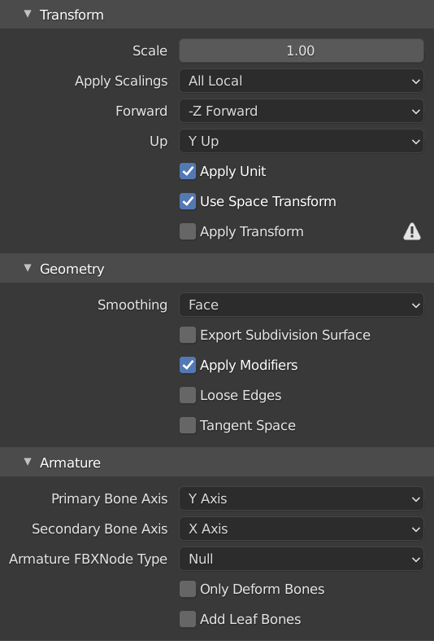

*It's suggested you know how to use blender for this*

# Meshes

- First download [blender](https://www.blender.org/download/) and add the appropriate version of the [PSK importer](https://github.com/Befzz/blender3d_import_psk_psa) to blender as an add-on in edit>Preferences>Install
- Export the model that you want to change using umodel and open a new blender project. Delete all the objects in the scene (cameras, lights, etc.)
- Go to file>import>PSK and select the exported mesh

- Set the units to metric

- You can now edit the model or add meshes, change UVs and vertex colours but do not change any names of the materials
- Right-click the model when selected and shade smooth

- Once you are satisfied with your creation, export the model as a .fbx with these settings (Most important are Face smoothing and unchecked add leaf bones)
 

- Rename it the name of the psk you imported. 
- Set up the UE4 project like normal(remember to turn off use pak file) and import the fbx into its respective folder
- You should get materials with it if you import it with default settings. put the materials in the folders they were in when exported and look in the props.txts that is in that folder. 
- If there is a reference to a parent material, then right click and create an instance of that material in UE4. delete the parent material and remove the _Inst from the end of the material instance's name. 
- Replace the references to the materials in the model and in the same order as in the mesh's props.txt. Once all that has been done you can package content and close the UE4 editor once packaging is complete. 
- Follow the same steps as normal in packaging except delete all the material uassets and uexps before using unrealpak. This is so the blank materials don't replace the actual ones. The mesh only needs references to the material. It should then work in game

