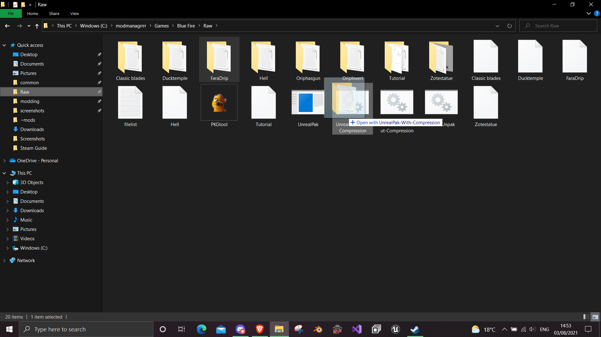
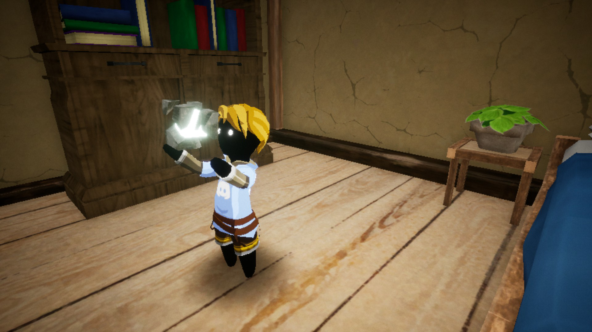

# Final Paking

- Go into the folder where you packaged your mod and copy the Content folder in WindowsNoEditor\\ProjectName into a new folder which your mod will be contained in.
- Now recreate the folder structure outside of content that was seen in Umodel (In Blue Fire's case a folder called Blue Fire)
- Folder structure is very important for UE4 modding so make sure spellings of the folders are the same as they were when exported
- Download [unrealpak](https://github.com/bananaturtlesandwich/Blue-Fire-Modding-Guide/blob/main/Tools/UnrealPak.zip) by FLuffyQuack and drag the mod folder onto UnrealPak-with-compression.bat

This will create a pak file. Rename the pak file with a _P at the end(so the game recognises it as a patch) and create a folder in C:\Program Files (x86)\Steam\steamapps\common\Blue Fire\Blue Fire\Content\Paks\~mods ,place the pak file in it and run Blue Fire to see if it worked. Hopefully you should find it did.

Guides on more types of mods are coming and can be found in the main README
If the mod worked, feel free to submit it to our [nexus mods page](https://www.nexusmods.com/bluefire/mods/) 
