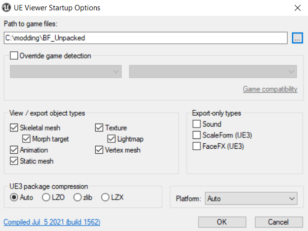
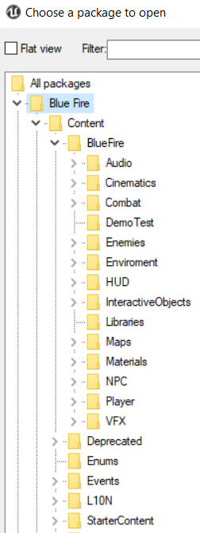
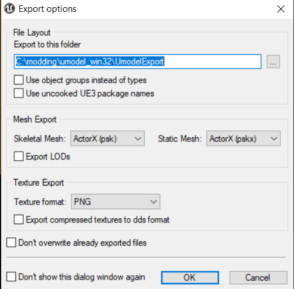

***Note that UModel has many more features than viewing and exporting, e.g showing related assets and toggling certain views - see them all using the dropdowns and by pressing H to see the keybinds***

For the next step you need umodel. Install the program from the links above and open the folder you extracted the game assets to, in my case BF_Unpaked.

With this you have access to the game files.

You can explore the game files and find something you want to replace or modify. Open a package by double clicking it. You should get a pop-up asking for the version of the package - enter 4.25

Find a package you would like to replace and view it. ctrl+x to export or export by using the tools pop-down. (here are my export preferences)

