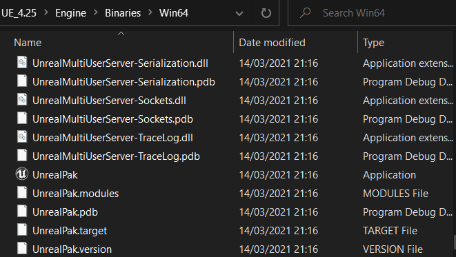
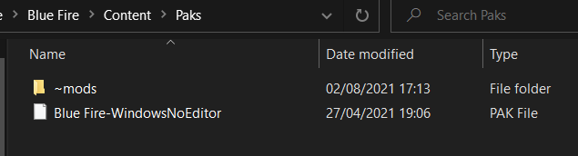

# Unpaking

# When BMS scripts don't work
[Here's a video detailing the process](https://youtu.be/AElxgCRXF64)-credits to mamoniem

*to find the version of UE your game uses hover over the game exe and it will show the version*

However here's a summary if some things are unclear:
Blue Fire is a game made with unreal engine 4.25 so uses pak files to store data. To access this data you must unpak this pak file. For this, you must have Unreal Engine 4.25.4 installed from the epic games launcher.
Open command prompt and drag unrealpak.exe into command prompt. This .exe should be stored in UE_4.25\Engine\Binaries\Win64\UnrealPak.exe

Then put a space and drag the pak file into command prompt. This file should be located in Steam\steamapps\common\Blue Fire\Blue Fire\Content\Paks assuming you installed it from steam. If you installed in on GOG then this will be in GOG games\Blue Fire\Blue Fire\Content\Paks

Put a space and type -Extract. Finally put a space after that and enter the directory of the folder you want the assets to be extracted to. Press enter and the game files should extract to the folder.

If there is an error, remember that syntax in important- here's mine for reference
"C:\Program Files (x86)\UE_4.25\Engine\Binaries\Win64\UnrealPak.exe" "C:\Program Files (x86)\Steam\steamapps\common\Blue Fire\Blue Fire\Content\Paks" -Extract C:\modding\BF_Unpaked

# When neither of these methods work
