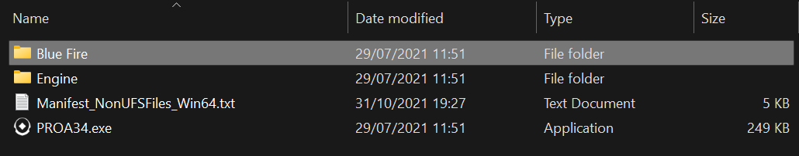
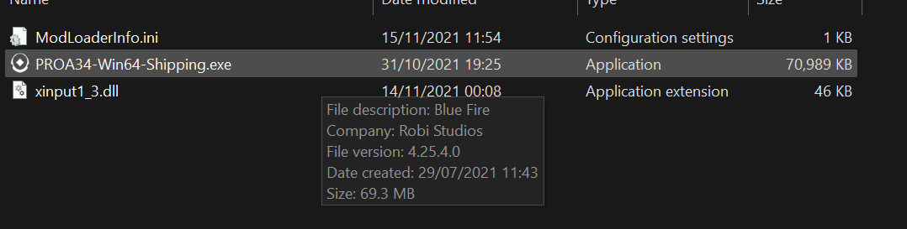

# Blueprint mods
**Contents**

- [UML setup](./Blueprint.md#uml-setup)
- [Project setup](./Blueprint.md#project-setup)
- [Mod creation](./Blueprint.md#)
- [Packaging](./Blueprint.md#)
- [.profile setup](./Blueprint.md#configuring-the-profile)
- [Auto-injector setup](./Blueprint.md#auto-injector-setup)

# UML setup
- Blueprint mods use a modloader to inject blueprint (Unreal's visual scripting system) into a game
- This allows addition of custom logic and events

- Download the [Universal Unreal Modloader](https://github.com/RussellJerome/UnrealModLoader/releases/) by [RusselJ](https://github.com/RussellJerome)
- This will contain a .exe, some .dlls and some .profile files in the profiles folder

- If your game does not have a .profile file contained in the release setup instructions are [here](./BluePrint.md#configuring-the-profile) 

- Run the .exe and then run the game to check that everything works fine (only report to `#support` if it's a red error)
- This should also generate a folder called `LogicMods` in Paks and a folder called `CoreMods` in Content

# Project setup
- Open the game folder where the Engine folder in located and copy the name of the other folder in that directory

- Now create a new Unreal Engine project with this name
- In project settings set pak chunking to true and keep use pak file checked
- Create a folder called `Mods`(remember capitals) and then create a new folder with the name of the mod
- Now create a new blueprint actor (I normally name it `ModActor`)

# Configuring the .profile

- To set up the .profile file, you will need to know 2 things: the name of the game binary located in `Game store/Game name/Game project name/Binaries/Win64` and the version of unreal engine the game runs on 
(**found by hovering your mouse over the same binary and looking at the version number**)

- Copy the BasicExampleGame.profile and rename it to the name of your game binary
- Then set the values according to the instructions using the UE4 version of your game(1 is true and 0 is false)
- Share the new .profile to the `#profiles` channel in [Russel's Exclusive Disco Club](https://discord.gg/ErTzBGtAUn) so that other's won't have to go through this process

# Auto Injector setup
- Out of the box, the modloader comes with an auto-injector (instructions are in the README but I'll explain here anyway)
- Open the ModLoaderInfo.ini and edit the path to where your modloader dll is stored
- Copy all the files(README isn't needed) to where the game binary is stored (in `Game store/Game name/Game project name/Binaries/Win64`)
- Run the binary and the modloader should auto-inject into the process (The auto-injector doesn't work for some games annoyingly)