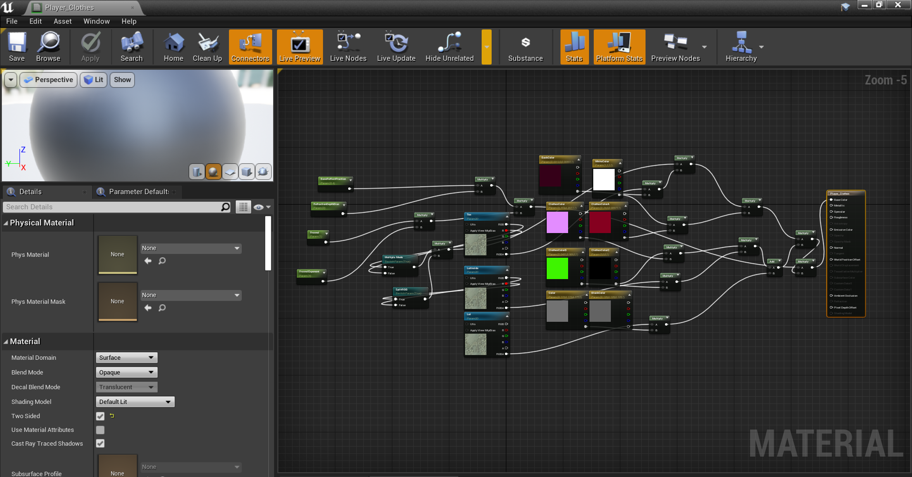

# Materials

**Credits to atenfyr for [UassetGUI](https://github.com/atenfyr/UAssetGUI/releases) and FatihG_ for the last method**

For pretty much everything, you can hex edit a material

If you wish to enable parameters from the parent material then the [in engine method](./Materials.md#in-engine-method) must be used

**Methods**

[Convenient Method](./Materials.md#convenient-method)

[Manual Method](./Materials.md#manual-method)

[In Engine Method](./Materials.md#in-engine-method)

### Convenient Method
This has no downsides to the other methods. The other methods are here if others wish to know them.
- Download [UassetGUI](https://github.com/atenfyr/UAssetGUI/releases) by atenfyr
- Set the version to whatever version of UE your game uses(For Blue Fire it's 4.25)
- Open the target material and search the exports for parameter values(names can be found in ParameterInfo)
- These can be changed in any way you wish

- File<Save as and recreate the file structure like normal
- Delete the .bak files (and the .uasset because you only changed values) and package

### In engine method
- There is also an alternate method for editing material instances in engine that I will put here for the sake of documentation

- First export the material instance you wish to modify normally using umodel
- Create a blank UE4 project (remember to untick use pak file) and create the appropriate folders for the material
- Create a new material and create parameters inside the material for each of the parameters in the props.txt
- Set them with their default values and names
- Connect all the parameters to the main node using math nodes (how you do it is not important)
  

- Once that is done, save the material and create a material instance of it with the same name as in the game files
- You can now edit the parameters as you please(enable any desired parameters)
- Once you are happy with the changes, save and package the project
- Package as normal except remove the parent material assets in final paking so that the parent material does not overwrite the actual parent material

