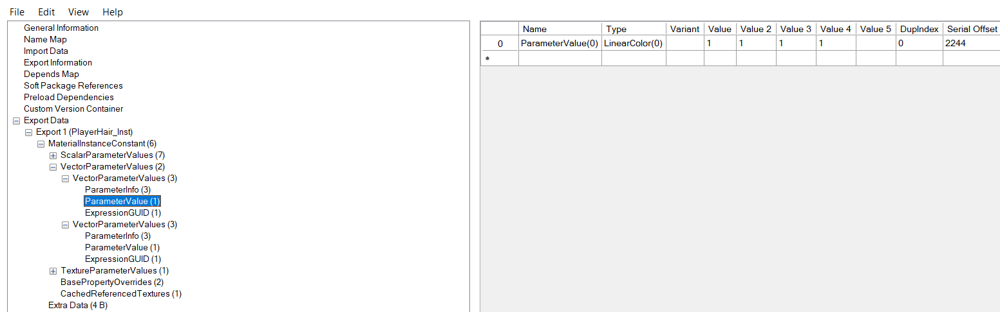

# Materials

To create a child of an existing material use the [in engine method](./Materials.md#in-engine-method)

### Asset Editing
- Download [UassetGUI](https://github.com/atenfyr/UAssetGUI/releases) by atenfyr
- Set the version to the version of UE4 your game uses
- Open the target material and search the exports for parameter values
- These can be changed in any way you wish

- File < Save as and recreate the file structure like normal
- Delete the .bak files (and the .uasset because you only changed values) and package

### In Engine
- Export the material instance you wish to modify normally using umodel
- Create a new dummy material in your project and create parameters inside the material for each of the parameters in the props.txt
- Set them with their default values and names
- Connect all the parameters to the main node using math nodes
- how you do this is not important - what's important is they are there
  
- Once that is done, save the material and create a material instance of it
- You can now edit the parameters as you please
- Once you are happy with the changes, save and package the project
- Package as normal except remove the parent material asset as it was a dummy

