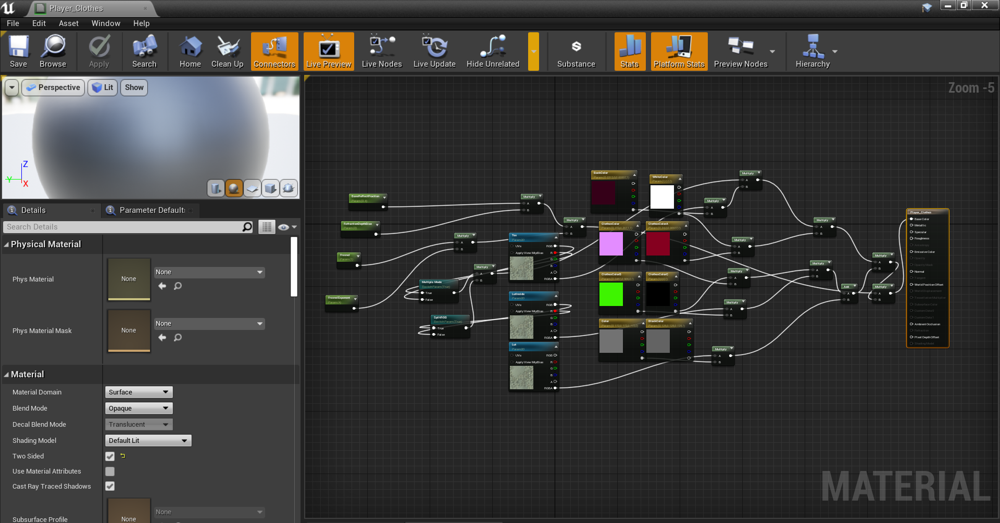

# In Engine
- Export the material instance you wish to modify normally using umodel
- Create a new dummy material in your project in the same location and create parameters inside the material for each of the parameters in the props.txt
- Set them with their default values and names
- Connect all the parameters to the main node
- How you connect is not important - what's important is they are connected (I used math nodes)
  
- Right-click and create a material instance to either replace an existing one or to use yourself
- You can now edit the parameters that are used as you please
- Once you are happy with the changes, save and package the project
- Package as normal except remove the parent material asset as it was a dummy