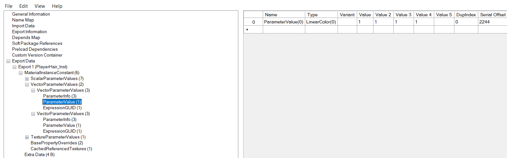

**To create a child material either copy an existing one and use this method or use the [in engine method](Engine.md) - this also allows you to change parameters that may not be present in the existing one**

# Via UAssetGUI
- Download [UassetGUI](https://github.com/atenfyr/UAssetGUI/releases) by atenfyr
- Set the version to the version of UE4 your game uses
- Open the target material and search the exports for parameter values
- These can be changed in any way you wish

- File < Save as and recreate the file structure like normal
- Delete the .bak files (and the .uasset because you only changed values) and package