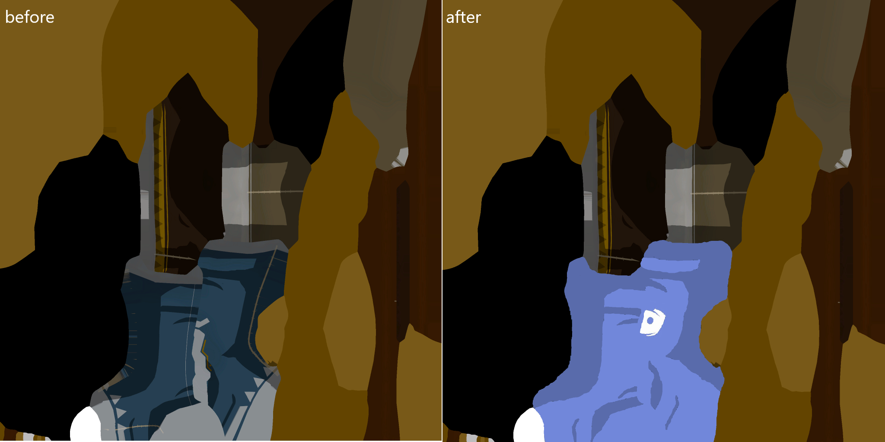
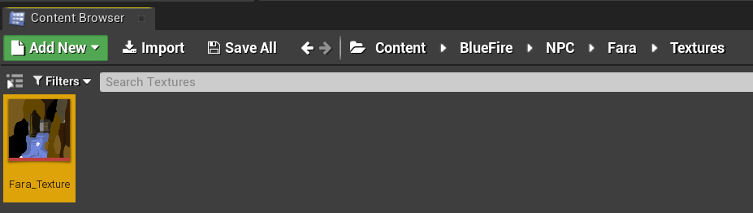

# Content Creation
### Content creation
**I will not cover content creation in this. Just examples.**
- For this example I will use my Fara discord shirt mod
- In this mod I modified the texture for Fara so that it had a discord logo

- Recreate the folder structure that was obtained from exporting the assets - in my case the folders went Game\BlueFire\NPC\Fara\Textures so I must create the folders like this:

- Press ctrl+shift+s to save all