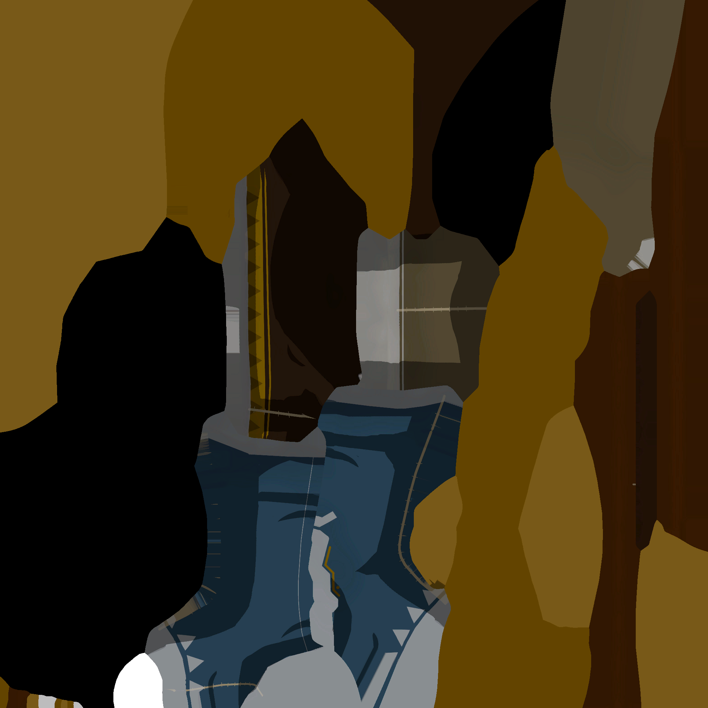
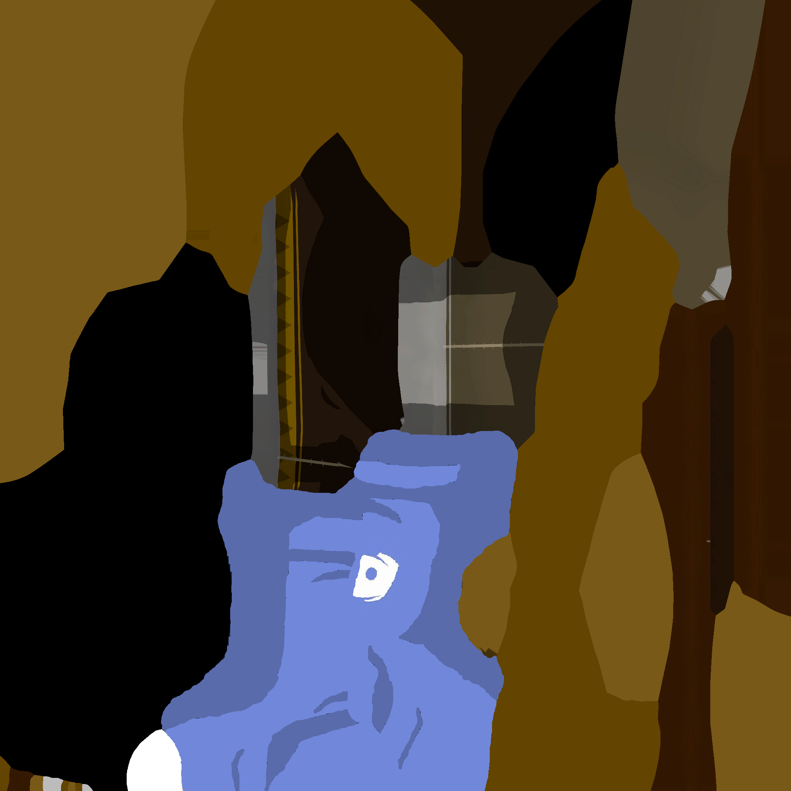
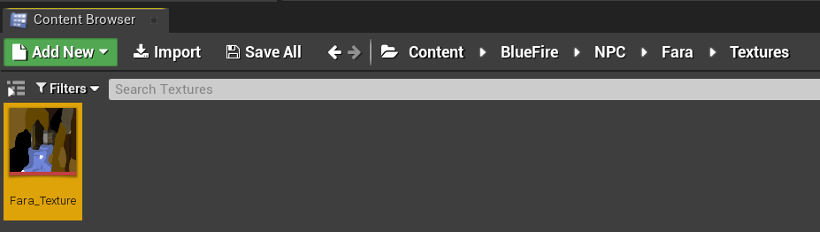

# Content Creation
### Content creation
**I will not cover content creation in this. Just examples.**
- For this example I will use my Fara discord shirt mod. Here is the original texture for Fara.

- I have now changed it so that the model will have the desired change

- Recreate the folder structure that was obtained from exporting the assets - in my case the folders went Game\BlueFire\NPC\Fara\Textures so I must create the folders like this:

- Press ctrl+shift+S to save all