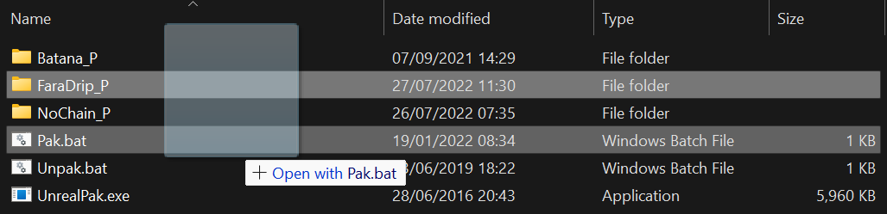

# Final Packaging

- Create a folder named `The name of your mod_P` (the `_P` clarifies it as a patch so that it overwrites original game content)

- Create a folder the name of your Game's project name

- Go into the folder where you packaged your mod and copy the Content folder in `WindowsNoEditor\ProjectName` into this folder

- Folder structure is very important for UE4 modding so make sure spellings of the folders are the same as they were when exported

- Download [Unrealpak](https://fluffyquack.com/tools/unrealpak.rar) by FluffyQuack and drag the mod folder onto UnrealPak-with-compression.bat

- This will create a pak file - Make sure the pak file still contains the _P at the end of its name
- Create a folder in your `Paks` folder called ~mods

(The folder is just to ensure proper load order. The folder can be named anything that starts with a letter after the first letter of the game pak) 
- Place the pak file in it and run your game to see if it worked. Hopefully you should find it did.

If the mod worked, give yourself a pat on the back! You have successfully made a patch mod!