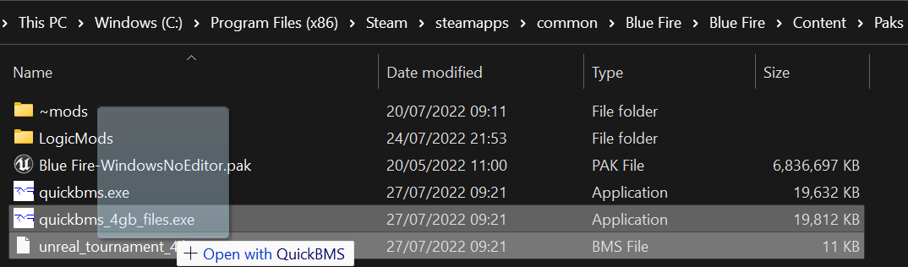

# QuickBMS
**This method will extract all of the raw assets out of the pak file so if you don't have space then I suggest [umodel](UEViewer.md) or [fmodel](FModel.md)**

**The advantage of this is immediate access to a file system with correct folder structure**

**With this method you will need to extract models and textures from the raw assets using [umodel](UEViewer.md) or [fmodel](FModel.md)**

- Download [QuickBMS](https://aluigi.altervista.org/papers/quickbms.zip) by Luigi Auriemma and [unrealtournament.bms](https://aluigi.altervista.org/bms/unreal_tournament_4.bms) and place them into your paks folder

- If the total file size of your pak/s is below 4 GB drag the bms file onto quickbms.exe (1,000,000 KB is one GB)

- If not use quickbms_4gb_files.exe

- A window should pop up asking for the archive

- Select your pak file that should look like `Game Project Name-WindowsNoEditor.pak` 

- If your game uses pak chunks type * into the text box instead to extract the folder

- Now select the output folder (this can be wherever)

- If compatible then the file should commence extraction

- If your pak is incompatible, try one of the other methods