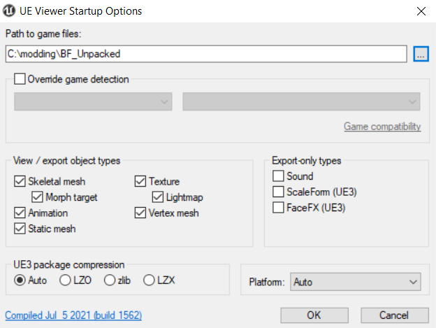
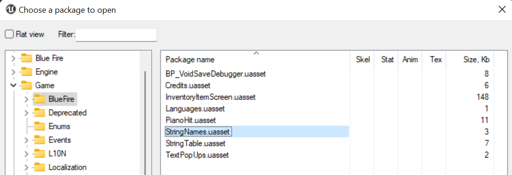
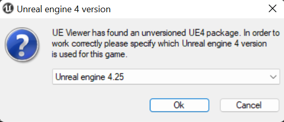

# UEViewer/umodel
**Note that UModel has many more features than just exporting, e.g showing related assets and toggling certain views - press H to see these extra functions**

- Install [umodel](https://www.gildor.org/en/projects/umodel) by Gildor

- Launch the program and you should be greeted with the startup screen

- If you extracted the raw assets using [QuickBMS](QuickBMS.md) or [UnrealPak](UnrealPak.md) then set the folder to the output folder you used using the `...` button and proceed

- If not then set the folder to your Paks folder and proceed

- You should now have access to your game's file system 

- **If you got an AES key prompt click [here](AES-Keys.md)**

- Open a package by double clicking it 

- The first time you should get a pop-up asking for the version of the package

- Enter the version of unreal engine your game uses

- Find something you want to replace or modify - *start with something simple (I'll be using a texture)*

-  Use ctrl + x or the tools tab to export and it will export to the directory selected