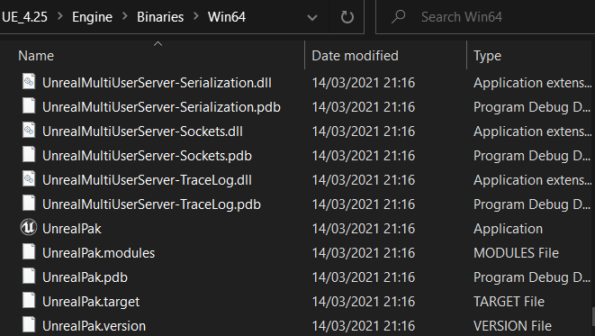
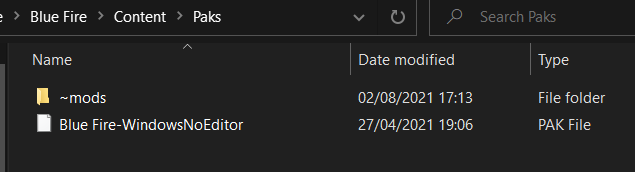

# Using UnrealPak directly

*To find the version of UE your game uses hover over the game exe and it will show the version*

[Here's a video detailing the process](https://youtu.be/AElxgCRXF64)

However here's a summary if some things are unclear:
- Open command prompt and drag unrealpak.exe into command prompt. This .exe should be stored in UE_4.XX(whatever version you have)\Engine\Binaries\Win64\UnrealPak.exe

- Then put a space and drag the pak file into command prompt

- Put a space and type -Extract

- Put a space after that and enter the directory of the folder you want the assets to be extracted to
- Press enter and the game files should extract to the folder

- If there is an error, remember that syntax in important- here's mine for reference
`"C:\Program Files (x86)\UE_4.25\Engine\Binaries\Win64\UnrealPak.exe" "C:\Program Files (x86)\Steam\steamapps\common\Blue Fire\Blue Fire\Content\Paks" -Extract C:\modding\BF_Unpaked`