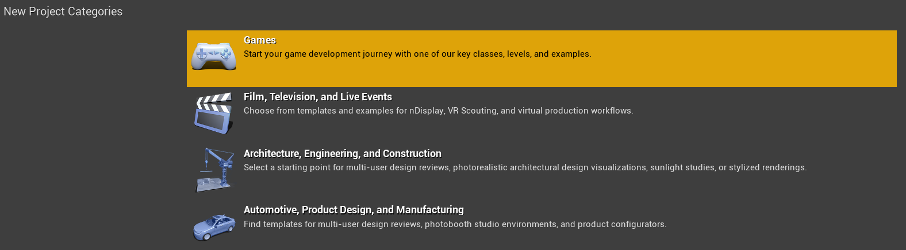
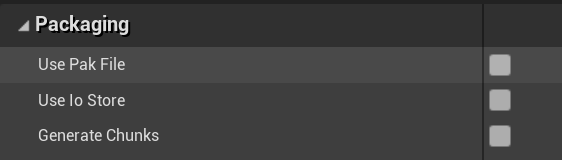

# Setting up
- Install the version of Unreal Engine 4 that your game uses from the [Epic Games Launcher](https://www.unrealengine.com/en-US/download)

- Open up UE4 and create a blank game project with no starter content (it's unnecessary)

- Go into edit > project settings and uncheck use pak file
