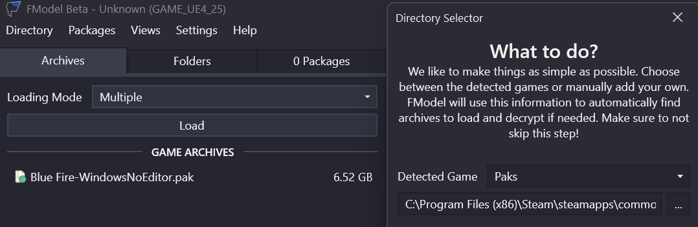

# Fmodel
- Install [Fmodel](https://fmodel.app/) by the Fmodel team

- Launch the program and you should be greeted with the startup screen

- Set the folder to your Paks folder using the `...` button and proceed

- Click on Settings and change the Unreal Version to your game's version (it will have to restart if changed)

- If there is red dot next to a pak file, go to Directory > AES and read [this](aes.md)

- Find something you want to replace or modify - *start with something simple (I'll be using a texture)*

- Double-click the asset (if a texture then the texture will appear on the right - you can then right-click > Save Texture)